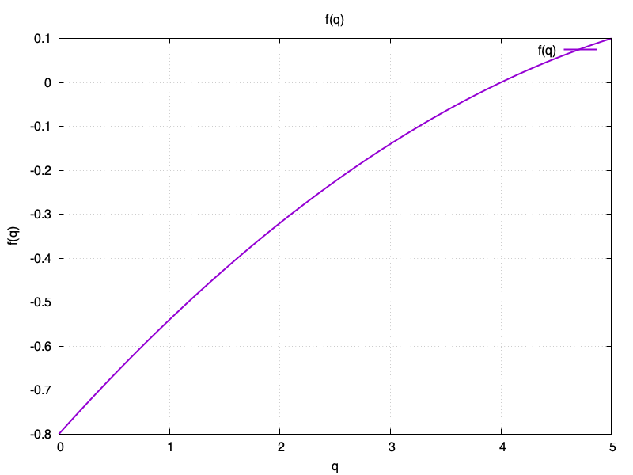
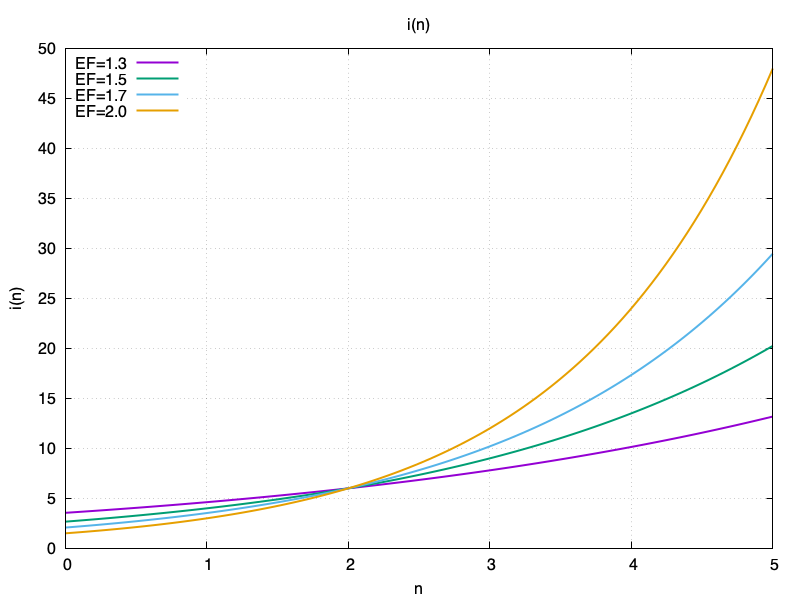

# sm2

An implementation of the [SM-2][sm2] algorithm from [SuperMemo][sm]. For my own elucidation.

[sm2]: https://super-memory.com/english/ol/sm2.htm
[sm]: https://en.wikipedia.org/wiki/SuperMemo

Plot of the change in EF as a function of response quality:

Interval as a function of correct repetitions, for different EF values:

